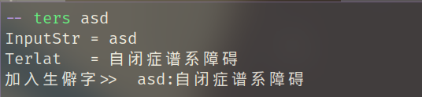
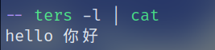
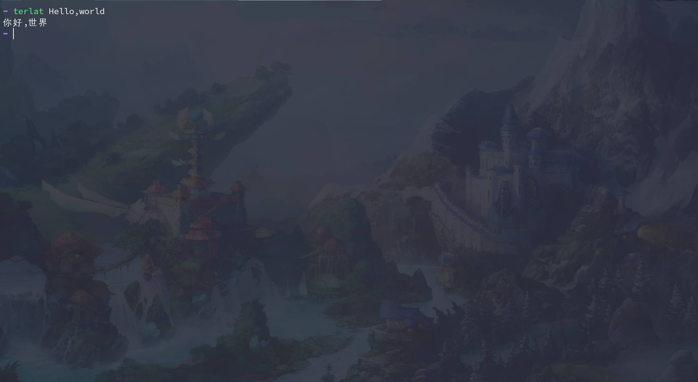

# My translation program


## Update the uncommon its record function

  
这次更新维护了之前的代码问题
之前使用
`terlat hello world` 将无法翻译`hello`后面的`world` 本次更新已经解决

### 添加翻译生僻字功能，生僻字将存在你的$HOME/.terlist/.terlist文件下

如果你想要查看生僻字 你可以 `python fanyim.py -l` 建议将`python fanyim.py` 加入到`bashrc`
`fanyim.py` 拥有`fanyi.py` 的所有功能但是`fanyi.py`更加简洁
另外当你不想使用`make install`而直接使用 `python fanyim.py`你需要自己创建.terlist/.terlist文件
```shell
echo "alias ters='python ./translation/fanyim.py'" >> bashrc
-- ters world
InputStr = world
Terlat   = 世界
world 世界 加入生僻字
```
translation 会过滤已有的生僻字和英文段子

当然你可以继续使用下面的默认安装方式

##  ---------------------------------------------------------------------
# My translation program

If you want to install the program follow

```

git clone https://github.com/denstiny/translation.git

```


## Installation

You can install it by using that command:

```shell

sudo make install

```

And you can run:

```shell

sudo make uninstall

```

To use it, you should do like this:
```shell
terlat "Hello,World."

# This is the output:
你好，世界。
```
To remove it.


## Dependencies

You need need these dependencies:

```

python3

requests

```

终端翻译

Terminal translator


## Other

If you're a vimmer,you can use [Terslation.vim](https://github.com/SpringHan/Terslation.vim).


## LICENSE

MIT

